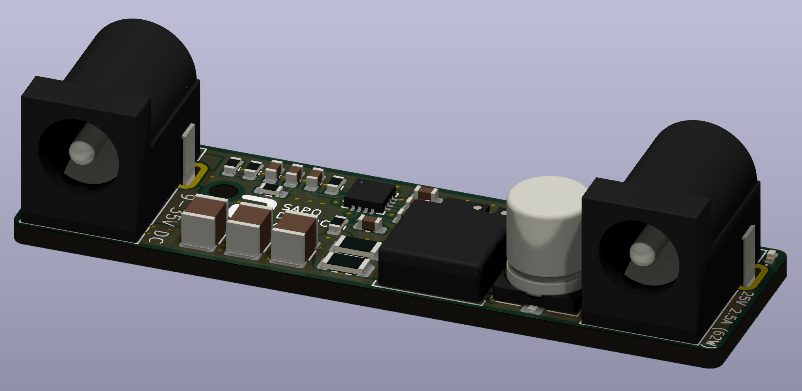
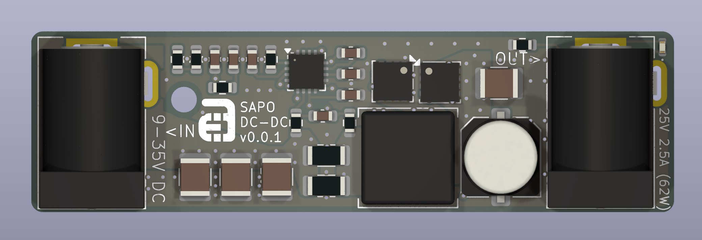
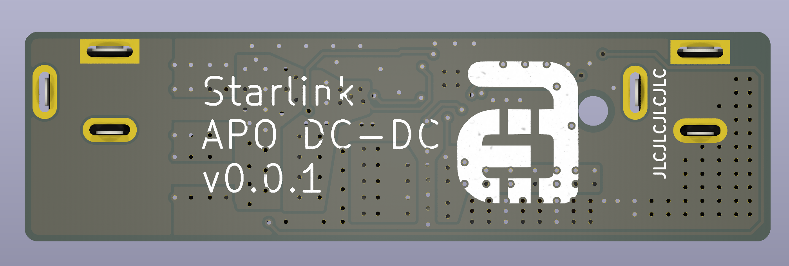
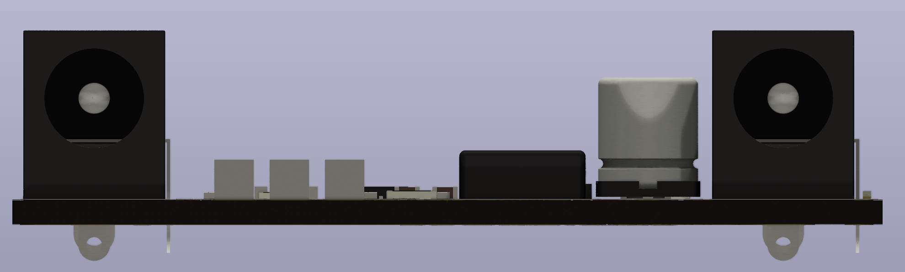

<h1 align="center">
    

  Ace's Electronics Pty Ltd  
  DC-DC converter for use in 12/24 volt systems
</h1>

# Looking to get up and running?
- [Wiki - Quickstart Guide](../../wiki/Quickstart-Guide)

# Project Goals:
The overall goal of this project is to make a simple, robust and reliable DC-DC converter for use in cars with smart alternators, such as the Next Gen Ranger and Everest. The DC-DC converter will be solid state and be able to handle input voltages in the range of 9-32V and output 25V 2.5A, or 62.5W.

# Design goals:  
- Smallest form-factor possible while being able to handle ~60W without getting too hot
- Can be used in-line with any cheap pass-through Starlink auxiliary 12V adapter
- Zero configuration
- Zero maintenance

# v0.0.1
Version 0.0.1 has been prototyped. I will hand assemble some test boards and do some testing. ~ETA for completion is 10/8/25.

# Where to Buy:
TBA, but most likely will be vvailable to purchase in Australia or New Zealand via <a href="https://d1b959-f7.myshopify.com/">The AE Store</a>

## Support:
Contact me direct via ace<@>aceselectronics.com.au, just make it look like a normal email address. (hiding from the bots ;)
